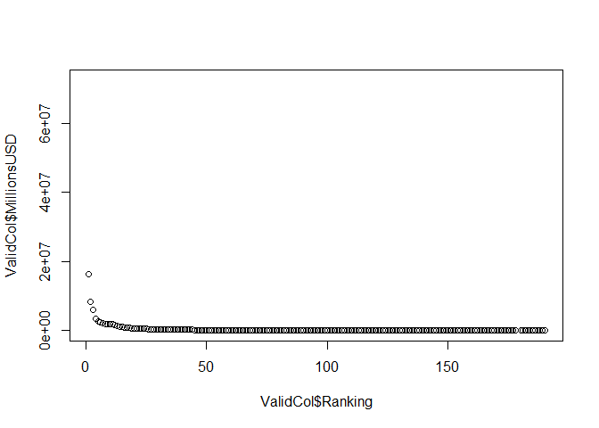
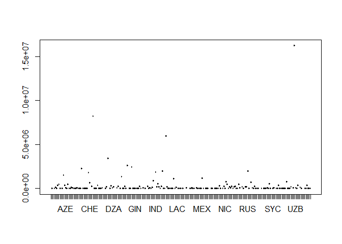
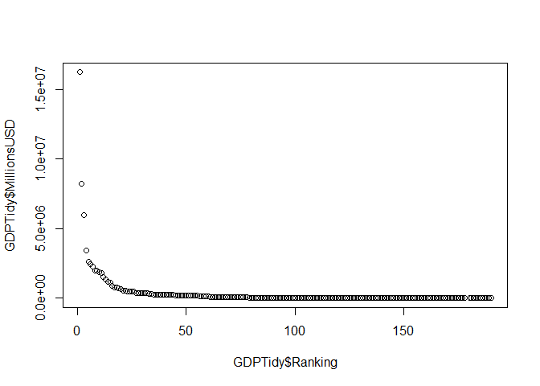
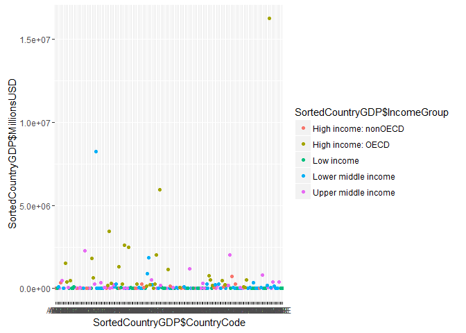

# Case Study 1
Tracie Scott  
November 1, 2016  


# Preparation 
## SET WORKING DIRECTORY in "housekeeping"" in r Code file on project root directory


```r
source("housekeeping",echo = TRUE)
```

```
## 
## > library(repmis)
## 
## > library(countrycode)
```

```
## Warning: package 'countrycode' was built under R version 3.3.1
```

```
## 
## > library(dplyr)
```

```
## Warning: package 'dplyr' was built under R version 3.3.1
```

```
## 
## Attaching package: 'dplyr'
```

```
## The following objects are masked from 'package:stats':
## 
##     filter, lag
```

```
## The following objects are masked from 'package:base':
## 
##     intersect, setdiff, setequal, union
```

```
## 
## > library(tidyr)
## 
## > library(ggplot2)
## 
## > sessionInfo()
## R version 3.3.0 (2016-05-03)
## Platform: x86_64-w64-mingw32/x64 (64-bit)
## Running under: Windows 10 x64 (build 14393)
## 
## locale:
## [1] LC_COLLATE=English_United States.1252 
## [2] LC_CTYPE=English_United States.1252   
## [3] LC_MONETARY=English_United States.1252
## [4] LC_NUMERIC=C                          
## [5] LC_TIME=English_United States.1252    
## 
## attached base packages:
## [1] stats     graphics  grDevices utils     datasets  methods   base     
## 
## other attached packages:
## [1] ggplot2_2.1.0    tidyr_0.4.1      dplyr_0.5.0      countrycode_0.18
## [5] repmis_0.5      
## 
## loaded via a namespace (and not attached):
##  [1] Rcpp_0.12.4       knitr_1.13        magrittr_1.5     
##  [4] munsell_0.4.3     colorspace_1.2-6  R.cache_0.12.0   
##  [7] R6_2.1.2          stringr_1.0.0     httr_1.1.0       
## [10] plyr_1.8.3        tools_3.3.0       grid_3.3.0       
## [13] gtable_0.2.0      data.table_1.9.6  R.oo_1.20.0      
## [16] DBI_0.4-1         htmltools_0.3.5   yaml_2.1.13      
## [19] digest_0.6.9      assertthat_0.1    tibble_1.2       
## [22] formatR_1.4       R.utils_2.3.0     evaluate_0.9     
## [25] rmarkdown_0.9.6   stringi_1.0-1     scales_0.4.0     
## [28] R.methodsS3_1.7.1 chron_2.3-47     
## 
## > setwd("C:/Users/User/Documents/CaseStudy1")
```
## Introduction - Questions of Interest
#### Client identified data sets containing Gross Domestic Product and global country income information for analysis to investigate the relationship between GDP and Income Group. The GDP file provies the Gross Domestic Product standarized in United States dollars for countries around the globe from 2012. Client also provided data that groups countries by Income Group, indicating assigned levels of incomes from the companies as well as OECD status. OCED, Economic Co-operation and Development, is an alliance to help promote developing countries.

#### We have merged these data frames by Country code, which is common to both files. Specifcally, client is interestd with the relationship of country income group and OECD participation relative to GDP.

#### Client submitted the following questions of interest.
#### Question A - How many countries had the appropriate data for analysis across the two data frames
#### Question B - Which country in the sorted data frame occupies the 13th row
#### Question C - What is the average ranking for High Income: OECD and High Income: non-OECD countries
#### Question D - Plot CountryCode by Country GDP in Millions, color by Income Group
#### Question E - How many countries are in the Lower Middle Income group among the top 20% of GDP


# Part 1 Gather and tidy data frames for GDP and Country information
## 1 - Download data set containing Gross Domestic Product (GDP) 
###Information from https://d396qusza40orc.cloudfront.net/getdata%2Fdata%2FGDP.csv
###Read downloaded .CSV file and assign to data frame GDPData
###Perform basic diagnostics


```r
setwd("Data")
source("GatherGDP",echo = TRUE)
```

```
## 
## > URLGDPdata <- "https://d396qusza40orc.cloudfront.net/getdata%2Fdata%2FGDP.csv"
## 
## > download.file(URLGDPdata, destfile = ".//GDPdata.csv")
## 
## > GDPdata <- read.csv("GDPdata.csv", header = TRUE)
## 
## > dim(GDPdata)
## [1] 330  10
## 
## > names(GDPdata)
##  [1] "X"                           "Gross.domestic.product.2012"
##  [3] "X.1"                         "X.2"                        
##  [5] "X.3"                         "X.4"                        
##  [7] "X.5"                         "X.6"                        
##  [9] "X.7"                         "X.8"
```

## Part 2 - Finalize the data set for analysis Gross Domestic Product (GDP)
### GDPTidy     
#### --- Containing only valid rows of country information as indicted by capital letters in column 1
#### --- Convert rankings from a factor to continueous numeric values
#### --- Convert GDP value from a factor wtih embedded commas to a continuous numberic value
#### --- Containing only necessary columns (other columns are not needed and contain mostly missing values)
### Variables will be:
#### CountryCode - Character - Three letter country code
#### Ranking     - Numeric   - Rank of GDP, starting with 1
#### --- Largest GDP has smallest rank number
#### --- Missing rank means GDP was not available
#### CountryGDP  - Character - Name for the geographic area related to GDP provided
#### --- May not actually be a recognized country
#### MillionsUSD  - Numeric - Gross Domestic Product (GDP) for the country in equivalient US dollars, in millions
#### --- Missing values means the data was not available
#### FootNote    - character value relating that country to notes in the original data file
### Step 2a - Create a temporary table with rows containing three-letter country codes
### Step 2b - Convert coerced factors to numeric data for Ranking and MillionsUSD
### Step 2c - Reduce columns to those likely to use for analysis
### Step 2d - Asign better variable names ("CountryCode", "Ranking", "CountryGDP", "MillionsUSD", "Footnote")
### Step 2e - Create simple plots to look for obvious issues with the data
#### Plots: 
#### MillionsGDP by RAnking data looks reasonable. 
#### Evidence of outliers in unranked data, MillionsGDP by CountryCode 
#### --- Perhaps as a result of bad data as inidcated by missing data values


```r
setwd("Data")
getwd()
```

```
## [1] "C:/Users/User/Documents/CaseStudy1/Data"
```

```r
source("TidyGDPData",echo = TRUE)
```

```
## 
## > ValidRows <- GDPdata[grep("^[A-Z]", GDPdata$X), ]
## 
## > ValidRows$Ranking <- as.numeric(as.character(ValidRows$Gross.domestic.product.2012))
## 
## > ValidRows$MillionsUS <- as.numeric(gsub(",", "", ValidRows$X.3))
```

```
## Warning: NAs introduced by coercion
```

```
## 
## > ValidCol <- ValidRows[, c(1, 11, 4, 12, 6)]
## 
## > names(ValidCol) <- c("CountryCode", "Ranking", "CountryGDP", 
## +     "MillionsUSD", "Footnote")
## 
## > plot(x = ValidCol$CountryCode, y = ValidCol$MillionsUSD)
```

<!-- -->

```
## 
## > plot(x = ValidCol$Ranking, y = ValidCol$MillionsUSD)
```

<!-- -->

```
## 
## > sum(is.na(ValidCol$Ranking))
## [1] 38
## 
## > sum(is.na(ValidCol$MillionsUSD))
## [1] 24
```


#### Numeric values are required for analysis. 
#### Count missing values then remove rows with missing values from final data frame.
#### Note: There were 38 missing values for Ranking.
#### Note: There were 24 missing values for GDP value MillionsGDP
### Step 2f - Create final data frame removing missing numeric values. Perform basic diagnositc on dataset.
### Step 2g - Create simple plots to look for obvious issues with the data


```r
setwd("Data")
source("TidyGDPData2",echo = TRUE)
```

```
## 
## > GDPTidy <- na.omit(ValidCol)
## 
## > dim(GDPTidy)
## [1] 190   5
## 
## > head(GDPTidy)
##    CountryCode Ranking     CountryGDP MillionsUSD Footnote
## 5          USA       1  United States    16244600         
## 6          CHN       2          China     8227103         
## 7          JPN       3          Japan     5959718         
## 8          DEU       4        Germany     3428131         
## 9          FRA       5         France     2612878         
## 10         GBR       6 United Kingdom     2471784         
## 
## > str(GDPTidy)
## 'data.frame':	190 obs. of  5 variables:
##  $ CountryCode: Factor w/ 229 levels "","ABW","ADO",..: 215 38 102 51 68 72 28 174 99 93 ...
##  $ Ranking    : num  1 2 3 4 5 6 7 8 9 10 ...
##  $ CountryGDP : Factor w/ 230 levels "","  East Asia & Pacific",..: 219 51 108 83 78 218 37 173 106 99 ...
##  $ MillionsUSD: num  16244600 8227103 5959718 3428131 2612878 ...
##  $ Footnote   : Factor w/ 7 levels "","a","b","c",..: 1 1 1 1 1 1 1 1 1 1 ...
##  - attr(*, "na.action")=Class 'omit'  Named int [1:38] 191 192 193 194 195 196 197 198 199 200 ...
##   .. ..- attr(*, "names")= chr [1:38] "196" "197" "198" "199" ...
## 
## > plot(x = GDPTidy$CountryCode, y = GDPTidy$MillionsUSD)
```

<!-- -->

```
## 
## > plot(x = GDPTidy$Ranking, y = GDPTidy$MillionsUSD)
```

<!-- -->

### GDPTidy looks suitable for analysis


## Part 3 - Finalize the data for country income data for analysis

### Download data set containg country information from https://d396qusza40orc.cloudfront.net/getdata%2Fdata%2FEDSTATS_Country.csv
### Read downloaded .CSV file and assign to CountryData, including the file header row
### Explore CountryData structure and content


```r
setwd("Data")
source("GatherCountry",echo = TRUE)
```

```
## 
## > URLCountry <- "https://d396qusza40orc.cloudfront.net/getdata%2Fdata%2FEDSTATS_Country.csv"
## 
## > download.file(URLCountry, destfile = ".//Country.csv")
## 
## > CountryData <- read.csv("Country.csv", header = TRUE, 
## +     na.strings = c("", " "))
## 
## > dim(CountryData)
## [1] 234  31
## 
## > names(CountryData)
##  [1] "CountryCode"                                      
##  [2] "Long.Name"                                        
##  [3] "Income.Group"                                     
##  [4] "Region"                                           
##  [5] "Lending.category"                                 
##  [6] "Other.groups"                                     
##  [7] "Currency.Unit"                                    
##  [8] "Latest.population.census"                         
##  [9] "Latest.household.survey"                          
## [10] "Special.Notes"                                    
## [11] "National.accounts.base.year"                      
## [12] "National.accounts.reference.year"                 
## [13] "System.of.National.Accounts"                      
## [14] "SNA.price.valuation"                              
## [15] "Alternative.conversion.factor"                    
## [16] "PPP.survey.year"                                  
## [17] "Balance.of.Payments.Manual.in.use"                
## [18] "External.debt.Reporting.status"                   
## [19] "System.of.trade"                                  
## [20] "Government.Accounting.concept"                    
## [21] "IMF.data.dissemination.standard"                  
## [22] "Source.of.most.recent.Income.and.expenditure.data"
## [23] "Vital.registration.complete"                      
## [24] "Latest.agricultural.census"                       
## [25] "Latest.industrial.data"                           
## [26] "Latest.trade.data"                                
## [27] "Latest.water.withdrawal.data"                     
## [28] "X2.alpha.code"                                    
## [29] "WB.2.code"                                        
## [30] "Table.Name"                                       
## [31] "Short.Name"
```

### CountryTidy  
#### --- Removing unneeded rows that contain summary data, as indicated by blank or missing IncomeGroup
#### --- Remove uneeded columns (this dataset has a large number of columns not used by this research effort)
### Variables will be:
#### CountryCode - Character - Three letter country code (used to merge data with GDP information)
#### ShortName   - Character - Informal abbreviated or shortened name for the country, may be helpful with charts
#### IncomeGroup - Character - Indicates relative level of income, inclucding OCED status (OCED or nonOCED)
#### LongName    - Character - Formal full name for the country
#### Region      - Character - Region name (may not be  used, but could be handy, so retained)
### Step 3a - Create a temporary table eliminating rows containing summary data (IncomeGroup is missing)
### Step 3b - Reduce columns to those likely to use for analysis
### Step 3c - Asign better variable names ("CountryCode", "ShortName", "IncomeGroup", "LongName", "Region")
### Step 3d - Perform basic dignositcs


```r
setwd("Data")
source("TidyCountryData",echo = TRUE)
```

```
## 
## > ValidRows <- CountryData[!is.na(CountryData$Income.Group), 
## +     ]
## 
## > CountryTidy <- ValidRows[, c(1, 31, 3, 2, 4)]
## 
## > names(CountryTidy) <- c("CountryCode", "ShortName", 
## +     "IncomeGroup", "LongName", "Region")
## 
## > dim(CountryTidy)
## [1] 210   5
## 
## > head(CountryTidy)
##   CountryCode            ShortName          IncomeGroup
## 1         ABW                Aruba High income: nonOECD
## 2         ADO              Andorra High income: nonOECD
## 3         AFG          Afghanistan           Low income
## 4         AGO               Angola  Lower middle income
## 5         ALB              Albania  Upper middle income
## 6         ARE United Arab Emirates High income: nonOECD
##                       LongName                     Region
## 1                        Aruba  Latin America & Caribbean
## 2      Principality of Andorra      Europe & Central Asia
## 3 Islamic State of Afghanistan                 South Asia
## 4  People's Republic of Angola         Sub-Saharan Africa
## 5          Republic of Albania      Europe & Central Asia
## 6         United Arab Emirates Middle East & North Africa
## 
## > str(CountryTidy)
## 'data.frame':	210 obs. of  5 variables:
##  $ CountryCode: Factor w/ 234 levels "ABW","ADO","AFG",..: 1 2 3 4 5 6 7 8 9 10 ...
##  $ ShortName  : Factor w/ 234 levels "Afghanistan",..: 10 5 1 6 2 220 8 9 4 7 ...
##  $ IncomeGroup: Factor w/ 5 levels "High income: nonOECD",..: 1 1 3 4 5 1 5 4 5 5 ...
##  $ LongName   : Factor w/ 234 levels "American Samoa",..: 5 104 57 99 108 226 4 109 1 2 ...
##  $ Region     : Factor w/ 7 levels "East Asia & Pacific",..: 3 2 6 7 2 4 3 2 1 3 ...
```

### Part 4 - Merge and Sort data frames with GDP and Country income information 
#### --- Merged data, sorted by MillionsGDP (least to greatest), will be used to answer questions of interest
### Variables will be:
#### CountryCode - Character - Three letter country code
#### Ranking     - Numeric   - Rank of GDP, starting with 1
#### CountryGDP  - Character - Name for the geographic area related to GDP provided
#### MillionsUSD - Numeric --- Gross Domestic Product (GDP) for the country in equivalient US dollars, in millions
#### FootNote    - character - value relating that country to notes in the text-based GDPDataNotes file
#### ShortName   - Character - Informal abbreviated or shortened name for the country, may be helpful with charts
#### IncomeGroup - Character - Indicates relative level of income, inclucding OCED status (OCED or nonOCED)
#### LongName    - Character - Formal full name for the country
#### Region      - Character - Region name (may not be  used, but could be handy, so retained)


```r
setwd("Data")
source("MergeGDPCountry",echo = TRUE)
```

```
## 
## > MergeCountryGDP <- merge(CountryTidy, GDPTidy)
## 
## > SortedCountryGDP <- MergeCountryGDP[order(MergeCountryGDP$MillionsUSD), 
## +     ]
```

### Part 5 Analysis - Anwers to questions of interest
#### Answer A - There were 189 rows matched by countrycode from both dataframes merged into the new dataframe
#### ------------- One country from GDPtidy did not match
#### Answer B - The 13th country in the sorted data frame is KNA St Kitts and Nevis
#### Answer C - The average ranking for High Income: OECD (33.0) and High Income: non-OECD (92) countries
#### ------------- OCED, Economic Co-operation and Development, is an alliance to help promote developing countries
#### ------------- As expected, average Ranking for OECD countries is much lower than non-OCED
#### Answer D - Plot CountryCode by Country GDP in Millions, color by Income Group
#### Answer E - There are four (4) countries in Lower Middle Income group among the 37 sorted nations with highest GDP
#### ------------ May indicate personal income is lagging the development of wealth in those countries


```r
setwd("Analysis")
source("CaseStudy1Analysis",echo = TRUE)
```

```
## 
## > setwd("..")
## 
## > setwd("Data")
## 
## > dim(MergeCountryGDP)
## [1] 189   9
## 
## > SortedCountryGDP[13, ]
##    CountryCode           ShortName         IncomeGroup            LongName
## 93         KNA St. Kitts and Nevis Upper middle income St. Kitts and Nevis
##                       Region Ranking          CountryGDP MillionsUSD
## 93 Latin America & Caribbean     178 St. Kitts and Nevis         767
##    Footnote
## 93         
## 
## > tapply(SortedCountryGDP$Ranking, SortedCountryGDP$IncomeGroup, 
## +     mean, na.rm = TRUE)
## High income: nonOECD    High income: OECD           Low income 
##             91.91304             32.96667            133.72973 
##  Lower middle income  Upper middle income 
##            107.70370             92.13333 
## 
## > ggplot(SortedCountryGDP, aes(y = SortedCountryGDP$MillionsUSD, 
## +     x = SortedCountryGDP$CountryCode, color = SortedCountryGDP$IncomeGroup)) + 
## +  .... [TRUNCATED]
```

<!-- -->

```
## 
## > SortedCountryGDP$quartile <- ntile(SortedCountryGDP$MillionsUSD, 
## +     5)
## 
## > table(SortedCountryGDP$quartile, SortedCountryGDP$IncomeGroup)
##    
##     High income: nonOECD High income: OECD Low income Lower middle income
##   1                    2                 0         11                  16
##   2                    4                 1         16                   9
##   3                    8                 1          9                  11
##   4                    5                10          1                  14
##   5                    4                18          0                   4
##    
##     Upper middle income
##   1                   9
##   2                   8
##   3                   9
##   4                   8
##   5                  11
```
## Conclusion
#### Client identified data sets containing Gross Domestic Product and global country income information for analysis to investigate the relationship between GDP and Income Group. 

#### We have merged these data frames by Country code, which is common to both files. Specifcally, client is interestd with the relationship of country income group and OECD participation relative to GDP.

#### In answering the questions of interest, we identified some interesting realtionships. As would be expected, OECD countries are on average ranked much lower in GDP than non-OECD countries. While OECD membership includes the United states, about 70 of the 100 OECD member countries are in the developing world. Reviewing both the plot and the table, we see some surprising relationships, inclduing four countries in the Lower Middle Income group that are in the top 20% of countries with the highest GDP, indicating that income in those countries is lagging that of other countries in their GDP peer group.
